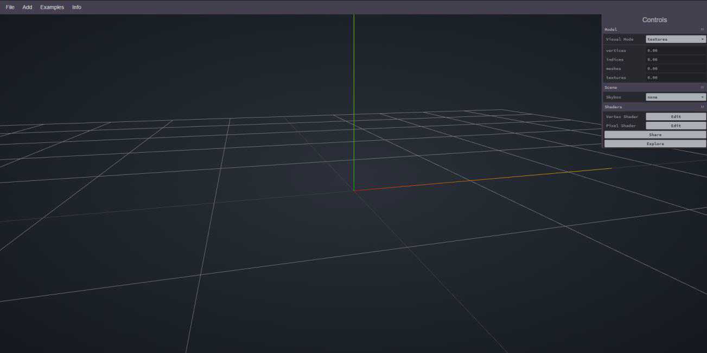
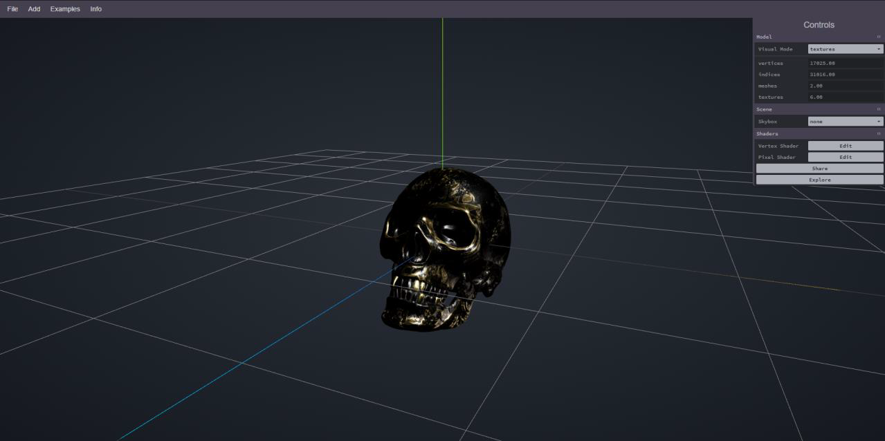
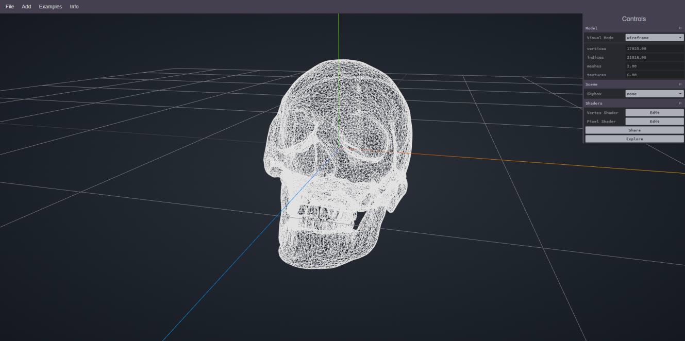
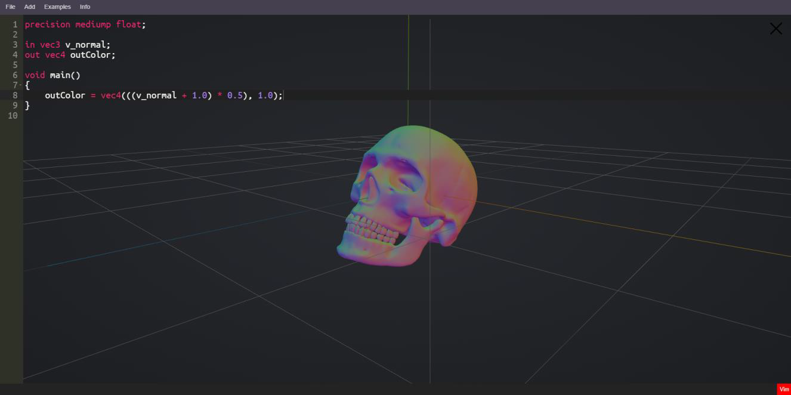
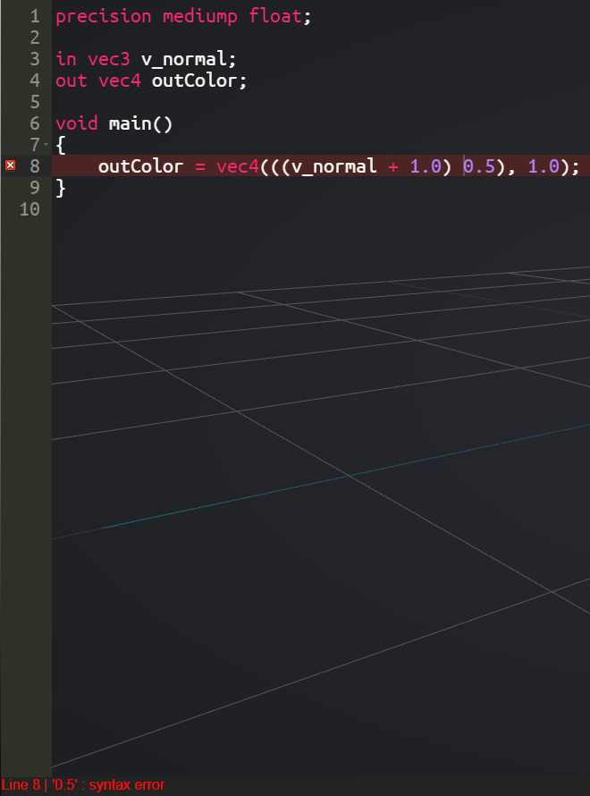
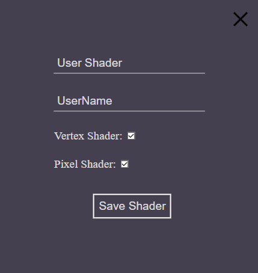
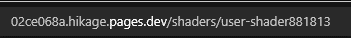
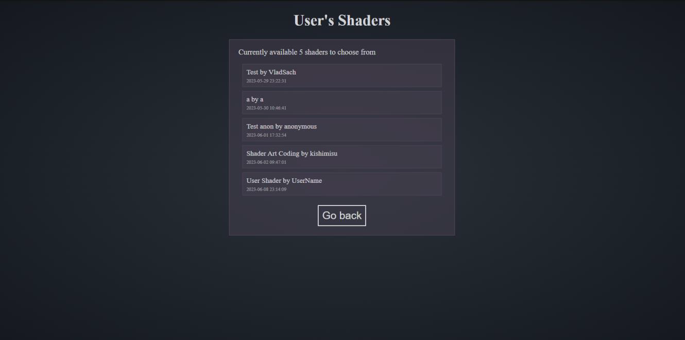
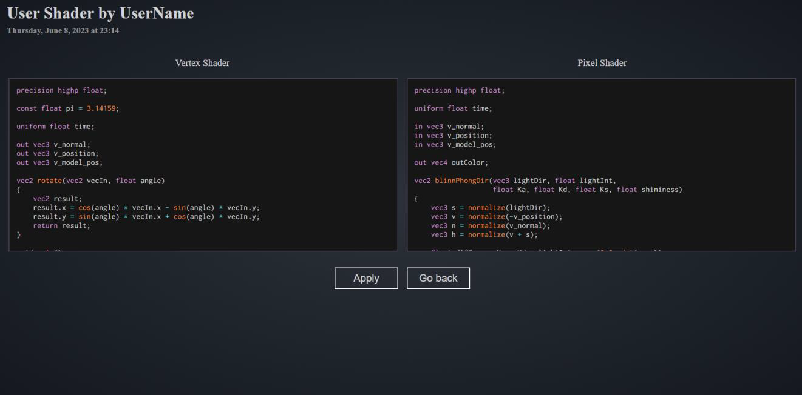
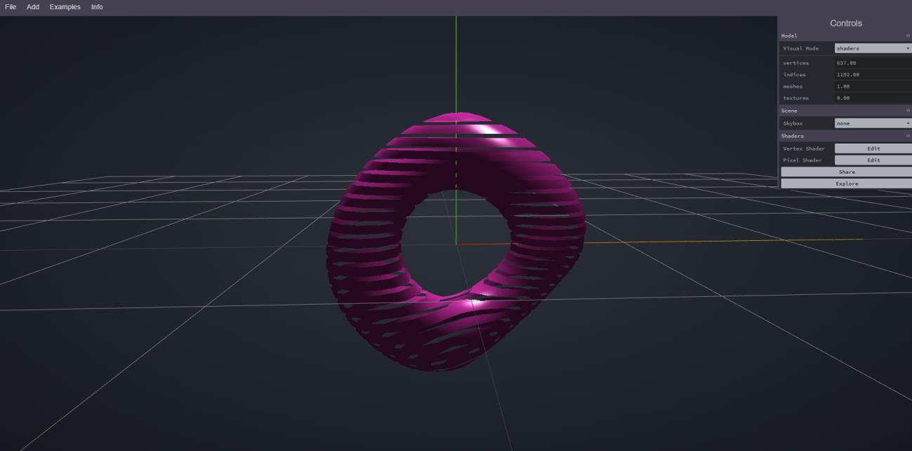

# Hikage - Shader Development Web Application
**Welcome to Hikage, a web application designed for working with 3D model shaders.**

Hikage provides users with convenient tools for shader development, along with a system for sharing them and the ability to explore effects created by other users.

## Getting Started
Upon opening the web application, users will encounter an empty viewer and a set of menu items for interaction ([See Initial Page](#initial-page)).

### Initial Page

Users can upload their own models or choose from available ones ([Example of Loaded Model](#loaded-model)). Additionally, users can change the display mode of the model or background ([Changing Display Mode](#changing-display-mode)) and open the code editor for the corresponding shader. **Currently supported only Vertex and Pixel Shaders.**

### Loaded Model

### Changing Display Mode

If a user decides to open the code editor, they can see the model changing in real-time as they write the shader code ([Working in the Editor](#working-in-the-editor)). Incorrect code is highlighted, and error notifications are displayed. ([Indicating Errors](#indicating-errors)).

### Working in the Editor

### Indicating Errors

## Sharing Shaders
At any point, users can share their shaders through a dedicated form ([Shader Sharing Form](#shader-sharing-form)). After saving, users are redirected to a page showcasing their saved effect with a unique URL ([Example URL](#example-url)).

### Shader Sharing Form

### Example URL

Users can also visit a page displaying all shared shaders and choose the ones that interest them. Returning to the editor page is possible by pressing the "Go back" button ([Shared Effects Page](#shared-effects-page)).

### Shared Effects Page

When viewing a shared shader ([Viewing Shared Shader](#viewing-shared-shader)), users can examine the shader code, return to the page with all user shaders, or apply the effect to see how it looks on a selected model ([Applying Shared Effect](#applying-shared-effect)).

### Viewing Shared Shader

### Applying Shared Effect
